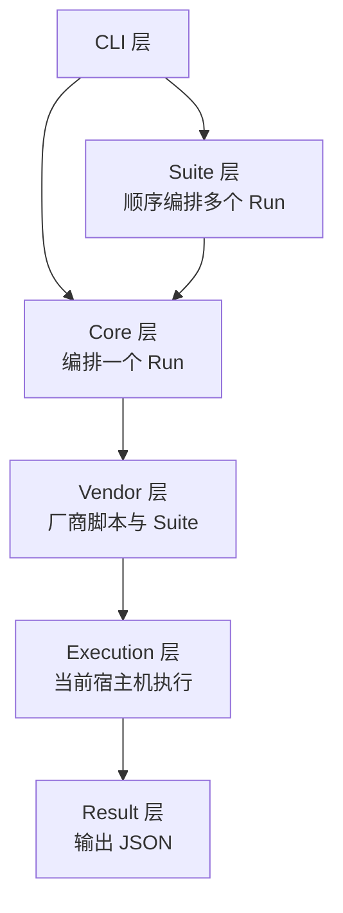

# LuBan-Meter 架构说明

## 1. 设计目标

LuBan-Meter 在用户已经准备好的厂商环境中执行 Benchmark。框架不搭建、切换
或修改厂商环境，只负责定位脚本、执行测试和输出结果。

核心约定：

- 一个 CLI 入口；
- 一个厂商一个目录；
- 厂商目录内保存自己的测试脚本和 Suite；
- 单任务与 Suite 共用同一个 CoreEngine；
- Suite 中的任务顺序执行并独立输出结果；
- 结果只整理和输出，不进行比较。

## 2. 分层架构



单任务调用链：

```text
CLI
→ RunRequest
→ vendors/<vendor>/benchmark/<module>/<benchmark>/
→ benchmark.py
→ raw_result.json
→ result.py
→ result.json
```

Suite 调用链：

```text
CLI
→ SuiteRequest
→ vendors/<vendor>/suites/<suite>.yaml
→ SuiteRunner
→ RunRequest 1 ... RunRequest N
→ 每个任务调用现有 CoreEngine
→ suite_result.json
```

## 3. 工程目录

```text
src/luban_meter/
├── cli.py
├── core/
│   ├── engine.py
│   ├── models.py
│   ├── config.py
│   ├── registry.py
│   └── errors.py
├── vendors/
│   ├── ascend/
│   │   ├── benchmark/
│   │   │   ├── generate/
│   │   │   ├── inference/
│   │   │   └── operation/
│   │   └── suites/
│   └── nvidia/
│       ├── benchmark/
│       │   ├── generate/
│       │   ├── inference/
│       │   └── operation/
│       └── suites/
├── suite/
│   ├── models.py
│   ├── loader.py
│   └── runner.py
├── execution/
│   ├── manager.py
│   ├── session.py
│   ├── host.py
│   ├── command.py
│   └── monitoring.py
├── result/
│   ├── manager.py
│   └── writer.py
└── utils/
```

`core/registry.py` 负责 Benchmark 分类、脚本发现、名称与路径校验；
`core/config.py` 负责 YAML 读取和格式检查。真实 Benchmark 实现归厂商所有，
统一放在 `vendors/<vendor>/benchmark/`。

## 4. 厂商脚本结构

```text
vendors/<vendor>/benchmark/<module>/<benchmark>/
├── benchmark.py
├── result.py
└── config.example.yaml
```

模块内多个场景需要共享采集或统计逻辑时，可在模块下增加不包含
`benchmark.py` 和 `result.py` 的 `common/` 目录：

```text
vendors/<vendor>/benchmark/<module>/
├── common/
├── <scenario-a>/
│   ├── benchmark.py
│   └── result.py
└── <scenario-b>/
    ├── benchmark.py
    └── result.py
```

`benchmark` 表示可独立执行的测试场景，不表示单个指标。同一场景中能由
同一批原始数据推导的指标，应一次采集后统一计算。

例如：

```text
vendors/ascend/
├── benchmark/
│   ├── generate/
│   │   ├── ttft/
│   │   └── throughput/
│   ├── inference/
│   │   └── qwen-inference/
│   └── operation/
│       ├── matmul/
│       └── ascend-flash-attention/
└── suites/
    ├── generate-basic.yaml
    └── full-benchmark.yaml
```

Ascend 和 NVIDIA 即使使用相同的模块名和脚本名，也拥有完全独立的实现。

## 5. 单任务执行

```bash
luban-meter run \
  --vendor ascend \
  --module generate \
  --benchmark ttft \
  --config configs/benchmarks/ascend-ttft.yaml \
  --model-path /data/models/Qwen3-8B \
  --model-name Qwen3-8B
```

脚本解析路径：

```text
vendors/ascend/benchmark/generate/ttft/
```

目录中必须同时存在 `benchmark.py` 和 `result.py`。

## 6. Suite 执行

Suite 与厂商绑定，一次 Suite 不允许混合多个厂商。

`vendors/ascend/suites/full-benchmark.yaml`：

```yaml
name: ascend-full-benchmark

tasks:
  - name: ttft
    module: generate
    benchmark: ttft
    config: configs/ttft.yaml

  - name: throughput
    module: generate
    benchmark: throughput
    config: configs/throughput.yaml

  - name: matmul
    module: operation
    benchmark: matmul
    config: configs/matmul.yaml
    timeout: 600
```

任务配置路径相对于 Suite YAML 所在目录解析，也可以填写绝对路径。

执行：

```bash
luban-meter suite \
  --vendor ascend \
  --suite full-benchmark \
  --model-path /data/models/Qwen3-8B \
  --model-name Qwen3-8B
```

SuiteRunner 按配置顺序执行任务。默认情况下，一个任务失败后继续执行后续
任务；使用 `--fail-fast` 可以在第一次失败时停止，剩余任务标记为
`skipped`。

## 7. 运行环境

LuBan-Meter 使用启动 CLI 的当前 Python、当前工作目录和当前 Shell 环境。

```bash
source /opt/ascend-vllm/bin/activate
export ASCEND_RT_VISIBLE_DEVICES=0

luban-meter suite --vendor ascend --suite full-benchmark
```

`--vendor` 只负责选择厂商目录，不会切换 Python、驱动或运行时环境。

## 8. Benchmark 脚本协议

Execution 层执行：

```text
<current-python> benchmark.py
  --request <run_dir>/request.json
  --output <run_dir>/raw/raw_result.json
```

原始结果必须使用：

```json
{
  "schema_version": "luban-meter.raw/v1",
  "status": "success",
  "metrics": {},
  "metadata": {},
  "artifacts": {}
}
```

同目录 `result.py` 必须提供：

```python
def process(raw_result):
    return {
        "metrics": {},
        "metadata": {},
    }
```

## 9. 输出目录

单任务：

```text
runs/<run_id>/
├── request.json
├── raw/
│   ├── raw_result.json
│   ├── stdout.log
│   ├── stderr.log
│   └── artifacts/
└── result.json
```

Suite：

```text
runs/<suite_id>/
├── suite_request.json
├── suite_result.json
└── tasks/
    ├── <task-run-id>/
    │   ├── request.json
    │   ├── raw/
    │   └── result.json
    └── ...
```

`suite_result.json` 只记录任务名称、状态、Run ID 和结果路径，不合并或比较
业务指标。

Suite 状态：

| 状态 | 含义 |
|---|---|
| `success` | 全部任务成功 |
| `partial_failed` | 部分任务成功 |
| `failed` | 没有任务成功 |

## 10. 扩展边界

- 新增厂商：增加 `vendors/<vendor>/benchmark/` 和 `suites/`；
- 新增测试方法：增加 `<module>/<benchmark>/` 目录；
- 新增测试组合：增加一个 Suite YAML；
- Suite 不负责环境切换、并行设备调度和结果比较；
- 各任务始终通过同一个 CoreEngine 独立执行和落盘。
